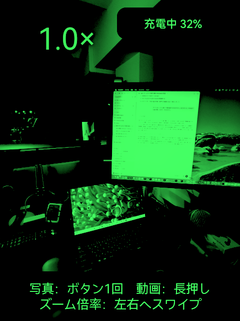
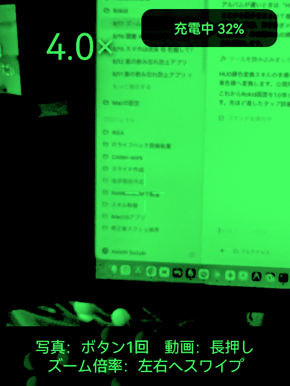
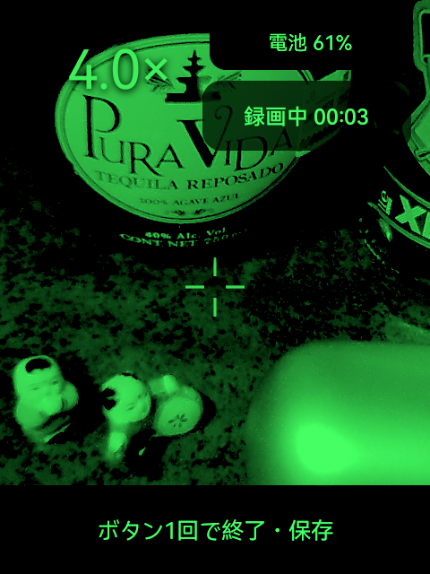

# Rokid ZOOM IN CAMERA

Rokid AI Glasses RV101で、遠くの文字や小さな物を1.0〜4.0倍に拡大して見るためのカメラアプリです。

見えている倍率のまま写真や音声付き動画を撮影し、スマートフォンのHi Rokidへ取り込めます。

**現在のバージョン: 1.1.0**

[Rokid ZOOM IN CAMERAの最新版をダウンロード](https://github.com/ksuzukigh/rokid-zoom-in-camera/releases/latest/download/Rokid-ZOOM-IN-CAMERA.zip)

## 1.0倍から4.0倍まで、その場で見比べる

左右へスワイプすると、`1.0 / 1.5 / 2.0 / 3.0 / 4.0倍`の順に切り替わります。画面中央の十字を見たい物へ合わせて使います。

<table>
  <thead>
    <tr>
      <th width="50%">1.0倍：周囲を広く見る</th>
      <th width="50%">4.0倍：中央を大きく見る</th>
    </tr>
  </thead>
  <tbody>
    <tr>
      <td align="center"></td>
      <td align="center"></td>
    </tr>
  </tbody>
</table>

> Rokid本体の単色表示に近づけた再現画像です。実際の見え方は周囲の明るさや装着位置によって異なります。

高倍率ではカメラ映像の中央を切り出して拡大するため、1.0倍より細部が粗くなります。

## できること

- カメラ映像を1.0〜4.0倍の5段階で拡大
- 右テンプルのボタンで写真を撮影
- 右テンプルのボタンを長押しして音声付き動画を撮影
- 倍率、電池残量、録画時間を画面内に表示
- 撮った写真と動画をHi Rokidからスマートフォンへ取り込み

## 操作方法

1. Rokidのアプリ一覧から「Rokid ZOOM IN CAMERA」を開きます。
2. 画面中央の十字を、見たい物へ合わせます。
3. 左右へスワイプして倍率を選びます。
4. 右テンプルのボタンで写真または動画を撮ります。

| したいこと | 操作 |
|---|---|
| 倍率を上げる | 右へスワイプ |
| 倍率を下げる | 左へスワイプ |
| 写真を撮る | 右テンプルのボタンを1回押す |
| 動画を始める | 右テンプルのボタンを長押しする |
| 動画を終える | 録画中に右テンプルのボタンを1回押す |

録画中は倍率を変更できません。録画を始める前に倍率を選んでください。

## 動画を撮る

録画を始めると、右上に「録画中」と経過時間が表示されます。長押しした指を離しても録画は続きます。終了するときは、右テンプルのボタンを1回押します。

<p align="center"></p>

> Rokid本体の単色表示に近づけた再現画像です。実際の見え方は周囲の明るさや装着位置によって異なります。

マイクの使用許可が表示された場合は「許可」を選んでください。許可しなかった場合、動画は開始しません。

## 電池残量を確認する

画面右上にRokid本体の電池残量を表示します。

| 状態 | 画面表示 |
|---|---|
| 通常 | `電池 68%` |
| 20%以下 | `電池少 20%` |
| 10%以下 | `要充電 10%` |
| 充電中 | `充電中 68%` |

長時間録画するときは、電池残量と本体の温度を確認してください。

## 写真と動画をHi Rokidへ取り込む

1. スマートフォンでHi Rokidを開き、Rokidと接続します。
2. Hi Rokidの`Gallery`（アルバム）を開きます。
3. 取り込みたい写真または動画を選び、スマートフォンへ保存します。

取り込んだ写真と動画は、スマートフォンで確認・整理・共有できます。Hi Rokidの画面名は、アプリのバージョンや表示言語によって異なる場合があります。

撮影直後の写真や動画が一覧に出ないときは、Hi Rokidを一度閉じて開き直してください。

## 撮影される写真と動画

| 項目 | 内容 |
|---|---|
| 写真 | 4032×3024ピクセルのJPEG |
| 動画 | 1920×1080ピクセルのMP4 |
| 動画方式 | H.264、約30fps、AAC音声 |

写真と動画の解像度はRokid ZOOM IN CAMERAが決めるため、Hi Rokidの撮影設定を変更しても基本的には変わりません。

ズーム倍率を上げてもファイルのピクセル数は同じです。高倍率では中央部分を拡大するため、細部は粗くなります。

## Rokid Controlと一緒に使う

[Rokid Control](https://github.com/ksuzukigh/rokid-mac-control)をMacで開いているときにRokid ZOOM IN CAMERAを起動すると、拡大した撮影画面がMacにもフルカラーで表示されます。

倍率、電池残量、録画時間をMacでも確認できます。Rokid ZOOM IN CAMERAを閉じると、Rokid Controlの元の画面へ自動で戻ります。

## 用意するもの

- **Rokid AI Glasses RV101**
- **Hi Rokidを入れたスマートフォン**
- **最初のインストールに使うMacまたはWindows 10/11のPC**
- **Rokidの開発用5ピンケーブル**
  RV101付属の3ピンケーブルは充電専用で、アプリのインストールには使えません。開発用ケーブルの入手方法は、Rokidの販売元またはサポートへ確認してください。

PCと開発用ケーブルを使うのは、Rokidへアプリを入れるときだけです。インストール後の撮影やHi Rokidへの取り込みにPCは必要ありません。

## 最初のインストール

### 1. Hi Rokidで開発者モードを有効にする

1. スマートフォンでHi Rokidを開き、Rokidと接続します。
2. 接続したRokidの設定を開きます。
3. `開発者モード`または`ADB`と表示された項目を有効にします。

開発者モード（ADB）は、PCからRokidへアプリをインストールするための設定です。開発用5ピンケーブルはPCとRokidを接続しますが、この設定がオフのままではインストーラーからRokidを見つけられません。

Hi Rokidの画面構成はバージョンによって変わる場合があります。項目が見つからない場合は、Hi Rokidを最新版へ更新し、Rokidが接続済みになっていることを確認してください。

### 2. アプリ一式をダウンロードする

[最新版ZIPをダウンロード](https://github.com/ksuzukigh/rokid-zoom-in-camera/releases/latest/download/Rokid-ZOOM-IN-CAMERA.zip)し、ダウンロードしたZIPファイルを展開します。

### 3. RokidをPCへつなぐ

1. Rokidの電源を入れます。
2. 開発用5ピンケーブルでRokidとPCをつなぎます。
3. RokidにUSB接続の確認が表示された場合は許可します。

### 4. インストーラーを開く

- **Mac**：`Rokidへアプリを入れる.command`をダブルクリックします。
- **Windows**：`install-rokid-zoom-in-camera.cmd`をダブルクリックします。

画面の案内に従い、「インストールが完了しました」と表示されたら準備完了です。必要な接続ソフトはインストーラーが自動で準備するため、HomebrewやAndroid Studioをあらかじめ入れる必要はありません。

<details>
<summary>Macに止められた場合</summary>

1. 警告画面では「ゴミ箱に入れる」を押さず、「完了」を押します。
2. Macの「システム設定」を開きます。
3. 「プライバシーとセキュリティ」を開き、一番下までスクロールします。
4. `Rokidへアプリを入れる.command`の「このまま開く」を押します。
5. 確認画面でもう一度「このまま開く」を押し、Macのログインパスワードを入力します。

</details>

<details>
<summary>Windowsに止められた場合</summary>

1. 「WindowsによってPCが保護されました」と表示されたら「詳細情報」を押します。
2. ファイル名が`install-rokid-zoom-in-camera.cmd`であることを確認します。
3. 「実行」を押します。

</details>

## 困ったとき

### インストーラーがRokidを見つけられない

- Hi Rokidで開発者モード（ADB）が有効になっているか確認します。
- RV101付属の3ピンケーブルではなく、開発用5ピンケーブルを使います。
- RokidにUSB接続の確認が表示されている場合は許可します。
- ほかのAndroid端末をPCへつないでいる場合は、いったん外してからやり直します。

### カメラ映像が表示されない

Rokid純正「カメラ」など、カメラを使用している別のアプリを閉じてからRokid ZOOM IN CAMERAを開き直します。

### Hi Rokidへ取り込めない

- RokidがHi Rokidで接続済みになっているか確認します。
- Hi Rokidの`Gallery`（アルバム）をいったん閉じ、開き直します。
- 取り込みが完了するまでは、Rokid側の写真や動画を削除しないでください。

## 安全性とプライバシー

- インターネット通信やクラウドへの送信は行いません。
- マイクは動画を録画している間だけ使用します。
- 位置情報、連絡先、利用状況の収集は行いません。
- 写真と動画は、Hi Rokidへ取り込むまでRokid本体に残ります。
- アプリ使用中は、Rokid標準カメラとの衝突を避けるため、カメラボタンの標準動作を一時停止します。
- アプリを閉じたとき、異常終了したとき、Rokidを再起動したときは、カメラボタンの標準動作へ戻ります。

詳しくは[プライバシー](PRIVACY.md)を参照してください。

## 使用時の注意

- Rokid AI Glasses RV101 / YodaOS専用です。
- 動画は1分あたり約90MBを目安に保存容量を使います。
- 長時間の録画では電池を多く消費し、本体が熱くなる場合があります。
- 周囲の安全を確認し、歩行中や運転中は操作しないでください。

## アプリを削除する

1. スマートフォンでHi Rokidを開きます。
2. 「ホーム」→「ツールボックス」→「メガネのアプリ管理」の順に開きます。
3. 「Rokid ZOOM IN CAMERA」の右側にある丸い「－」ボタンを押し、画面の案内に従います。

アプリを削除しても、撮影済みの写真と動画は消えません。必要なものは、あらかじめHi Rokidへ取り込んでください。

## 関連アプリ

- [Rokid Control](https://github.com/ksuzukigh/rokid-mac-control)：Rokidの画面をMacに表示し、Macから操作します。
- [Photo to Mac](https://github.com/ksuzukigh/rokid-photo-to-mac)：Rokidで撮った写真を、同じWi-Fi上のMacへ直接送ります。
- [Wi-Fi ON](https://github.com/ksuzukigh/rokid-wifi-on)：RokidのWi-FiとMac操作用接続を、メガネ単体で復旧します。

<details>
<summary>開発者向け情報</summary>

JDK 17とAndroid SDKが必要です。

```bash
./gradlew test lint assembleDebug
```

本プロジェクトはRV101実機とYodaOSの公開・観測可能な動作を調査し、一から実装しています。第三者の未ライセンスのソースコードや素材は使用していません。

</details>

## ライセンス

MIT License（詳細は[LICENSE](LICENSE)）
